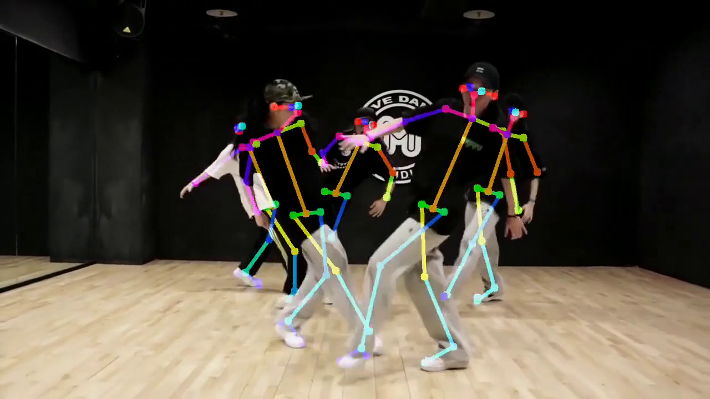

# Ascend OpenPose


| Requirement | Version                   |
| ----------- | ------------------------- |
| OS          | Ubuntu 18.04              |
| OpenCV      | 4.x compiled with GCC 7.5 |
| OpenMP      | default with GCC          |
| CANN        | 3.3.0 or above            |

supported Ascend Hardware：Atlas300-3000/3010、Atlas800-3000/3010

### Performance：



<video id="video" height=360 width=640 controls="controls">
    <source src="https://infer-model.obs.cn-north-4.myhuaweicloud.com:443/openpose/result.mp4?AccessKeyId=9ZDA1G0YE9DZH8KPKRYY&Expires=1662713929&Signature=1LcswvPep38kECExFDrteTjtLBE%3D" type="video/mp4">
</video>


| Hardware  | e2e latency | model input geometry | FPS  |
| --------- | ----------- | -------------------- | ---- |
| Ascend310 | 45.4ms      | 368x448              | 22   |

### 1.Caffe model trans to ascend model

OpenPose body25 model can be download [here](https://e-share.obs-website.cn-north-1.myhuaweicloud.com?token=MFauHUS9RTc29nWvKbznEDcJ09rEfJ5OL1p9/lHy6CcAEHuGRZfKLt/2KUzoS0GDdvGygs6a6BwDeSFq0/VRpBR9XLoSB7hjOzmRik1qDwT+ql4HyanLxexrE7HFce0Q1KIXM59KaaKsZuOg1DjMx2iMJY91bhT2dL+u37zsfGysOatrU3M7e6DDlNuDyBA8ljO5NutgzpcGx7ISKxHNQBHBWprWxsDsLmE4zpyx4wRrsYnJfcma80jJ0zV6cMM+4JbPBtNwm3u0Zx7SbSQBD9rsrFaPALtL9Z4nlf3g2J0zw0mMzsZh2Eep0oAo1wjKc38FZMjqAr1yYwkfNIbPAToVtxS6Lzrvefumj+jiUkkfTzErKGQf7Kq0dvkLAApl2AIQf1JyE9FGPwdYpMKkwZl0UU90OPDK1ytgmoYjQqGzL9LY5g4JtgRsLMCwywPWm7qo2seGiya1/lJS6WF1tefBon3rwsfyaLoK3/IG9+i6uWdsnlpiF2xVPFSWgwpVkBPtf1UrmU92RBbeF/Tntnpo1r4QERfL53DrAxO5jGH6W3Bh6lVlNVWXt5sZLqbprXVBRpEn9V2eGA7RY2c9lg==) , passwd:123456

##### trans yolov5.onnx to om with ATC

```shell
source /usr/local/Ascend/ascend-toolkit/set_env.sh
atc --model=body_25.prototxt --weight=body_25.caffemodel --framework=0 --output=body25 --soc_version=Ascend310 --insert_op_conf=aipp_rgb.cfg --input_format=NCHW --input_shape="images:1,3,368,448"
```

| param         | statement                                          |
| ------------- | -------------------------------------------------- |
| --model       | prototxt                                           |
| --weight      | caffemodel                                         |
| --output      | output om file                                     |
| --input_shape | model input shape: (batch, channel, width, height) |

### 2.Compile and Run program

##### 2.1 modify CMakeLists.txt 

```cmake
set(OpenCV_DIR /root/opencv4.4/lib/cmake/opencv4) #your own opencv path
...
set(ACL_PATH /usr/local/Ascend/ascend-toolkit/latest) #your own cann-toolkit path
```

##### 2.2 Compile it

```shell
mkdir build
cd build
cmake ..
make -j8
```

##### 2.3 Run it

```shell
./ACL_OPENPOSE model/body25.om test.mp4

===============================
ModelProcess:Begin to inference.
detected people:5
fps:21.1667
===============================
```

### Reference:

EasyOpenPose: https://github.com/dlunion/EasyOpenPose
